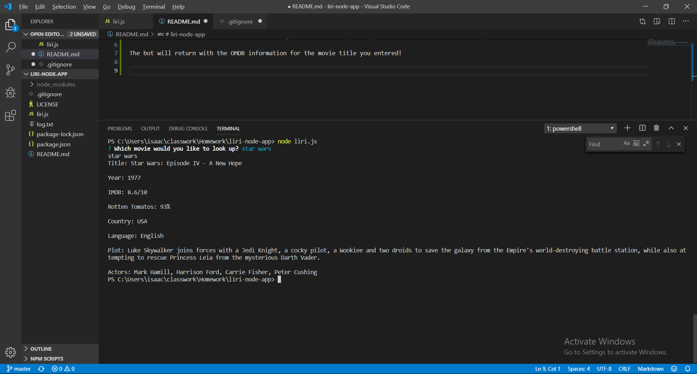

# liri-node-app

In order to start the bot, type node liri.js and smash that enter button.

You will be prompted with "Which movie would you like to look up?". Type in the title of a movie and press enter.

The bot will return with the OMDB information for the movie title you entered!

